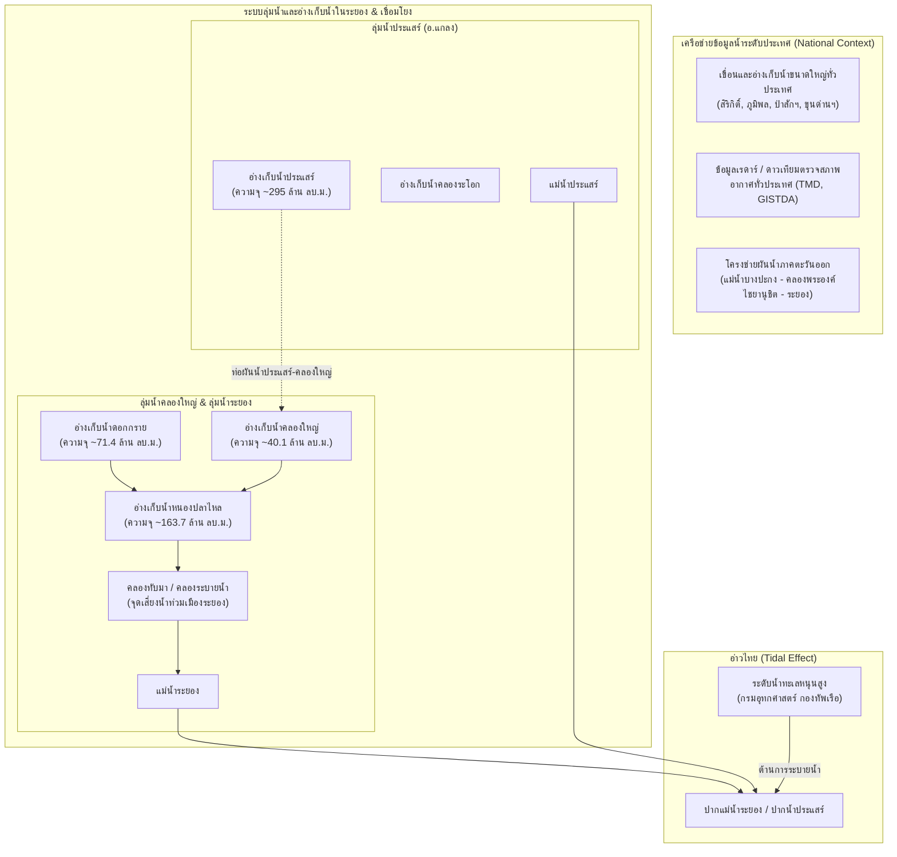

# แผนผังสถาปัตยกรรมระบบ: Rayong Smart Flood Monitoring, Forecasting & Decision Support System (RW-DSS)

ระบบบริหารจัดการ เฝ้าระวัง ติดตาม และพยากรณ์สถานการณ์น้ำท่วมจังหวัดระยอง แบบบูรณาการข้อมูลแหล่งน้ำระดับประเทศและระดับลุ่มน้ำย่อย

---

## 1. บริบทอุทกวิทยาและโครงสร้างทางกายภาพของระยอง (Hydrological Context)

การจัดการน้ำในจังหวัดระยองมีความพิเศษและซับซ้อนกว่าพื้นที่อื่น เนื่องจากเป็นทั้งพื้นที่ชุมชนเมือง/เศรษฐกิจ (เทศบาลนครระยอง, ทับมา), พื้นที่อุตสาหกรรมหลักของประเทศ (มาบตาพุด, EEC) และพื้นที่เกษตรกรรม โดยมีแม่น้ำ ลุ่มน้ำ และโครงข่ายผันน้ำสำคัญดังนี้:

### ปัจจัยเสี่ยงหลักของน้ำท่วมระยองที่ต้องนำเข้าโมเดลวิเคราะห์:
1. **Flash Flood จากฝนตกหนักสะสม:** ฝนตกในพื้นที่เทือกเขาแถบตอนบน (เขาชะเมา, นิคมพัฒนา, ปลวกแดง) ไหลหลากลงมายังคลองทับมาและแม่น้ำระยอง
2. **น้ำหลากระบายผ่านประตูระบายน้ำ/การระบายจากอ่างเก็บน้ำ:** หากปริมาณน้ำเกิน 80-90% ของความจุในอ่างฯ หนองปลาไหล/ดอกกราย/ประแสร์ จนต้องระบายลงคลองธรรมชาติ
3. **ระดับน้ำทะเลหนุน (Sea Level / High Tide):** หนุนสูงบริเวณปากน้ำระยอง ทำให้น้ำในแม่น้ำระยองและคลองทับมาไม่สามารถระบายออกทะเลได้ เกิดปรากฏการณ์น้ำเอ่อล้นตลิ่งเข้าท่วมชุมชน

---

## 2. โครงสร้างสถาปัตยกรรมระบบ (System Architecture)

```mermaid
flowchart LR
    subgraph DataSources ["1. Data Acquisition (แหล่งข้อมูลภายนอก)"]
        API_HII["HII / Thaiwater API<br/>(โทรมาตรน้ำฝน, ระดับน้ำ, น้ำท่า)"]
        API_RID["RID Smart Water API<br/>(ความจุเขื่อน, Inflow/Outflow ทั่วประเทศ)"]
        API_TMD["TMD Radar / WRF Models<br/>(เรดาร์ฝน, พยากรณ์ฝน 72 ชม.)"]
        API_NAVY["กรมอุทกศาสตร์ ทร.<br/>(พยากรณ์น้ำขึ้น-น้ำลง ปากน้ำระยอง)"]
        API_GISTDA["GISTDA Satellite<br/>(ดาวเทียมชี้เป้าพื้นที่น้ำท่วม)"]
        IoT_Rayong["Local IoT Sensors<br/>(CCTV, ตรวจวัดระดับน้ำทับมา/เมืองระยอง)"]
    end

    subgraph DataIngestion ["2. Ingestion & Pre-processing Layer"]
        Airflow["Apache Airflow / Celery<br/>(Batch Pipeline & Scheduler)"]
        Kafka["Kafka / Redis Streams<br/>(Real-time Telemetry Ingestion)"]
        DataValidator["Data Cleaning & Geocoding Service"]
    end

    subgraph StorageLayer ["3. Multi-Model Data Storage"]
        TimescaleDB[("TimescaleDB (PostgreSQL)<br/>Time-Series: Sensor, Rain, Dam Volume")]
        PostGIS[("PostGIS<br/>Spatial: Catchment, Streams, Risk Zones")]
        MinIO[("MinIO Object Storage<br/>Radar Rasters, Satellite Tiles, Model Outputs")]
        RedisCache[("Redis Cache<br/>Real-time Dashboard Metrics")]
    end

    subgraph ForecastingEngine ["4. AI & Hydrological Forecasting Engine"]
        HydroModel["Hydrological Engine<br/>(Rainfall-Runoff Model)"]
        AI_LSTM["AI/ML Model (LSTM / XGBoost)<br/>(พยากรณ์ระดับน้ำล่วงหน้า 6-24-72 ชม.)"]
        TideCoupling["Tidal Backwater Coupling Module<br/>(วิเคราะห์ผลกระทบน้ำทะเลหนุน)"]
        InundationEngine["Inundation Risk Evaluator<br/>(แผนผังน้ำท่วมจำลอง 2D/Flood Map)"]
    end

    subgraph APIServices ["5. Application & Integration Layer"]
        FastAPI["FastAPI Gateway / Core Backend"]
        AlertService["Early Warning & Notification Engine<br/>(LINE Notify, SMS, Push Notification)"]
        GeoServer["GeoServer / Vector Tile Server (MVT)"]
    end

    subgraph PresentationLayer ["6. Unified Dashboard Interface"]
        UI_National["National Water Overview<br/>(ภาพรวมน้ำทั้งประเทศ & เขื่อนหลัก)"]
        UI_Rayong["Rayong Real-time Geo-Map<br/>(เรดาร์ฝน, สถานะคลอง, โซนเสี่ยงภัย)"]
        UI_Forecast["Forecasting & Hydrograph Charts<br/>(กราฟคาดการณ์น้ำ 24-72 ชม.)"]
        UI_DamManager["Reservoir & Water Grid Balancer<br/>(สถานะ 4 อ่างหลักระยอง & ท่อผันน้ำ)"]
    end

    DataSources --> DataIngestion
    DataIngestion --> StorageLayer
    StorageLayer --> ForecastingEngine
    ForecastingEngine --> StorageLayer
    StorageLayer --> APIServices
    APIServices --> PresentationLayer
```

---

## 3. แหล่งข้อมูลบูรณาการ (Data Integration Matrix)

| องค์กร / แหล่งข้อมูล | โปรโตคอล / รูปแบบข้อมูล | ความถี่ | วัตถุประสงค์ในการวิเคราะห์ |
| :--- | :--- | :--- | :--- |
| **สสน. (HII - ThaiWater)** | REST API / JSON | ทุก 10-15 นาที | ระดับน้ำลำน้ำหลัก, ปริมาณฝนสถานีโทรมาตร, สถานะน้ำล้นตลิ่ง |
| **กรมชลประทาน (RID)** | REST API / Scraping / JSON | รายวัน / รายชั่วโมง | ความจุอ่างเก็บน้ำ, ปริมาณน้ำกักเก็บ (% Storage), น้ำไหลลงอ่าง (Inflow), การระบายน้ำ (Outflow) ทั้งประเทศ และระยอง |
| **กรมอุตุนิยมวิทยา (TMD)** | Grid API / NetCDF / Radar Tiles | ทุก 15-30 นาที | เรดาร์ตรวจอากาศสัตหีบ/ระยอง (Composite Radar), แบบจำลองฝน WRF พยากรณ์ล่วงหน้า 72 ชม. |
| **กรมอุทกศาสตร์ กองทัพเรือ** | Harmonic Tide Tables / API | รายชั่วโมง | ค่าระดับน้ำทะเลขึ้นสูงสุด-ต่ำสุด (High/Low Tide) ปากน้ำระยอง |
| **สทนช. (ONWR)** | Open Data Portal | รายวัน | แผนจัดสรรน้ำ, ประกาศเตือนภัยระดับชาติ |
| **IoT เทศบาลนครระยอง / ทับมา** | MQTT / REST API | เรียลไทม์ (1-5 นาที) | ระดับน้ำหน้าประตูระบายน้ำ, อัตราการสูบน้ำของสถานีสูบน้ำคลองทับมา |

---

## 4. กลไกการวิเคราะห์และพยากรณ์น้ำแบบเรียลไทม์ (Analytics & AI Engine)

ระบบพยากรณ์แบ่งออกเป็น 3 โมดูลทำงานร่วมกัน (Hybrid Simulation & ML):

### 4.1 Rainfall-Runoff Transformation (แปลงฝนเป็นน้ำท่า)
*   นำข้อมูลฝนจาก **เรดาร์ TMD (ปรับเทียบค่าด้วยสถานีวัดน้ำฝนภาคพื้นดิน - Gauge Adjusted Radar)** รวมกับ **ฝนคาดการณ์จาก Weather Models (WRF 3km/ECMWF)**
*   คำนวณการดูดซับของดิน (Soil Moisture Index) จากข้อมูล GISTDA/ดาวเทียม เพื่อหาค่า Runoff Coefficient (อัตราน้ำท่าที่ไหลลงสู่ลำน้ำ)

### 4.2 Streamflow & Water Level Prediction (AI/ML Sequence Modeling)
*   ใช้สถาปัตยกรรม **LSTM (Long Short-Term Memory) + Temporal Fusion Transformer (TFT)**
*   **Input Features:**
    *   ฝนสะสมย้อนหลัง 1 ชม., 3 ชม., 6 ชม., 24 ชม. ใน catchment
    *   ฝนพยากรณ์ล่วงหน้า 6 ชม., 12 ชม., 24 ชม., 48 ชม.
    *   อัตราการระบายน้ำจากอ่างฯ ดอกกราย, หนองปลาไหล, คลองใหญ่, ประแสร์
    *   ระดับน้ำทะเลหนุน (Tide Level) ปากแม่น้ำ
    *   ระดับน้ำและอัตราการไหลปัจจุบันที่สถานีวัดระดับน้ำ
*   **Target Output:**
    *   ระดับน้ำคาดการณ์ราย 15 นาที ล่วงหน้า 6 – 72 ชั่วโมง ที่จุดวิกฤต เช่น **สะพานทับมา, วัดน้ำคอก, ตลาดระยอง, สะพานท่าสถิตย์**

### 4.3 Hydrodynamic & Tidal Backwater Coupling
*   วิเคราะห์ผลกระทบกรณี **"น้ำหลากปะทะน้ำทะเลหนุน" (Tidal Lock):**
    $$Q_{\text{effective}} = f(H_{\text{river}} - H_{\text{sea}}, \text{Gate Status}, \text{Pump Capacity})$$
*   เมื่อระดับน้ำทะเล $H_{\text{sea}} \ge H_{\text{river}}$ ระบบจะจำลอง Backwater Curve และคำนวณปริมาณน้ำเอ่อท้นตลิ่ง พร้อมแจ้งเตือนให้เปิดเครื่องสูบน้ำอัตโนมัติ
